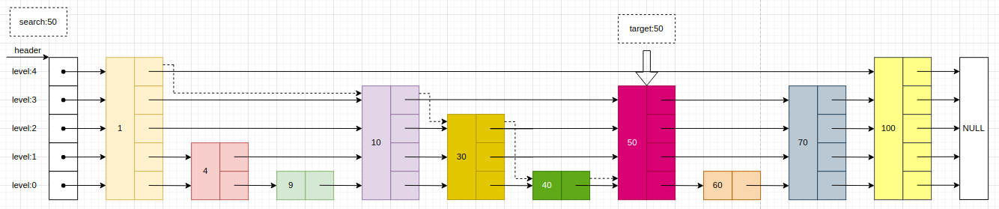
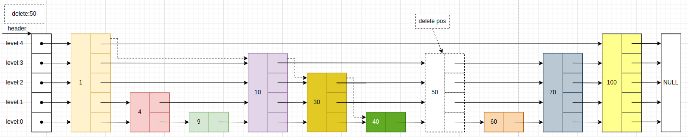
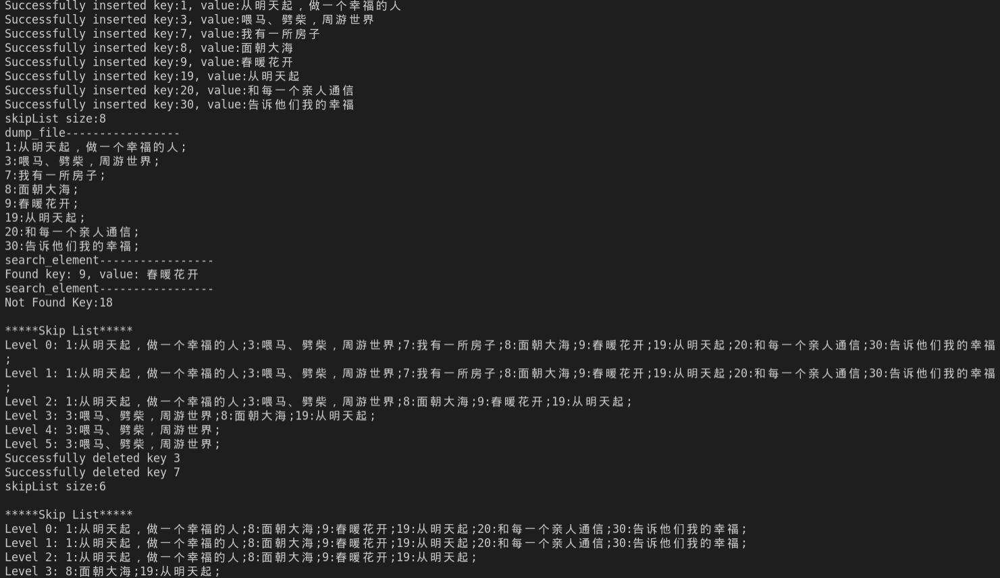

# KV存储引擎
非关系型数据库redis其核心的存储引擎是跳表。
本项目是基于跳表实现的轻量级键型存储引擎，使用C++实现。
实现的功能有：
+ 插入数据(insertElement)
+ 删除数据(deleteElement)
+ 查询数据(searchElement)
+ 展示已经存储的数据(displayList)
+ 数据落盘(dumpFile)
+ 加载数据(loadFile)
+ 返回数据(size)
在随机写读情况下，该项目每秒可处理啊请求数（QPS）: 8.49w，每秒可处理读请求数（QPS）: 5.78w。
# 项目中的文件说明
+ include文件包含头文件skiplist.h，用于跳表的核心实现
+ src文件中包含main.cpp，使用跳表进行数据操作。
+ README.md项目说明和项目记录
+ bin文件中包含可执行文件的目录
+ CMakeLists.txt编译脚本
+ store数据落盘的文件存放在这个文件夹中
+ stress_test_start.sh 压力测试脚本
+ build文件存放cmake的生成的makefile
+ picture文件存放图片
# 存储引擎数据表现
## 插入操作
跳表树高:15
采用随机插入数据的测试：
| 插入数据规模(万条) | 耗时(秒) |
| ---- | ---- |
|       10          |    0.98      |
|       50        |      5.49    |
|       100          |   11.78       |

每秒可处理写请求数(QPS)：8.49w
## 取数据操作
| 取数据规模(万条) | 耗时(秒) |
| ---- | ---- |
|       10          |    1.46      |
|       50        |      8.03    |
|       100          |   17.31       |

每秒可处理读请求数(QPS):5.78w
插入为什么会比查询操作快？
**插入是从0开始插入的，查询是从已有结果查询，插入自然快一些，如果你先插10万条，测第二次的插入10万条时间，就比查询慢了。**
# 项目运行方式
```bash
cmake ..
cd build
make
cd ..
cd bin
./skiplist
```
使用脚本测试kv存储引擎的性能
```
sh stress_test_start.sh
```
# 项目记录
## 查找元素

从当前最大层数开始找，如果查找的键比`cur`的下一个节点的键值大,cur就往后移动
找到大于等于`key`的第一个节点，如果那个节点等于`key`，就说明找到了，否则就没有该`key`。
## 插入元素
如果只把多个节点(很多很多)插入到最后一层中，然后不对上层的索引进行更新的话，那么再查找插入的节点过程中，在最后一层查找元素的过程就会退化成单链表查找的情况。
解决方法：在插入的最后一层每，两个节点提取一个节点给上一层。
怎么动态更新:
> 概率算法：
> + 每一层的节点，被提取到上一层的概率是1 / 2;
> + 原始链表提取到一级索引的概率是1 / 2。
> + 原始链表提取到二级索引的概率是1 / 4。
> + 原始链表提取到三层索引的概率是1 / 8。
```c++
    /*
        1/2的概率返回1。
        1/4的概率返回2。
        1/8的概率返回3。
        ....
    */
    int k = 1;
    while (rand() % 2) {
        k++;
    }
    k = (k < _max_level) ? k : _max_level;
```


|  层数    | update数组值 |
| ---- | ---- |
| 4 | update[4] = 1; |
| 3 | update[3] = 10; |
| 2 | update[2] = 30; |
| 1 | update[1] = 30; |
| 0 | update[0] = 40; |

插入的关键代码:
```c++
for (int i = 0; i <= random_level; i++) {
    inserted_node->forward[i] = update[i]->forward[i];
    update[i]->forward[i] = inserted_node;
}
```
这里从图中可以看出random_level是3。
插入的点是50,将50插入到每一层对应的位置上。
**单层插入：**
```cpp
50->forward[0] = update[0]->forward[0]; //将50插入到第零层上
update[0]->forward[0] = 50;
```
## 删除元素
跟插入节点一样的操作，先要记录删除节点每一层的前继节点，然后每一层做一个链表删除节点的操作

|  层数    | update数组值 |
| ---- | ---- |
| 4 | update[4] = 1; |
| 3 | update[3] = 10; |
| 2 | update[2] = 30; |
| 1 | update[1] = 30; |
| 0 | update[0] = 40; |
删除的关键代码:
```cpp
//从最底层开始删除，然后删除每层该元素的索引
for (int i = 0; i <= _skip_list_level; i++) {

    //如果在第i层，下一个节点不是目标节点，那吗跳出循环。
    if (update[i]->forward[i] != current) 
        break;
    update[i]->forward[i] = current->forward[i];
}
```
## 显示结果



